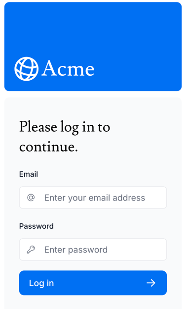

## Next.js fundamental tutorial
This projects helps me familiarize the basic manipulations and concepts of next.js including server-side rendering, fetching data from remote database, mutating date, handling errors and tackling authentication

### Image Gallery

Try it out
Now, try it out. You should be able to log in and out of your application using the following credentials:

Email: user@nextmail.com
Password: 123456

[website link](https://nextjs-dashboard-show.vercel.app/) 
